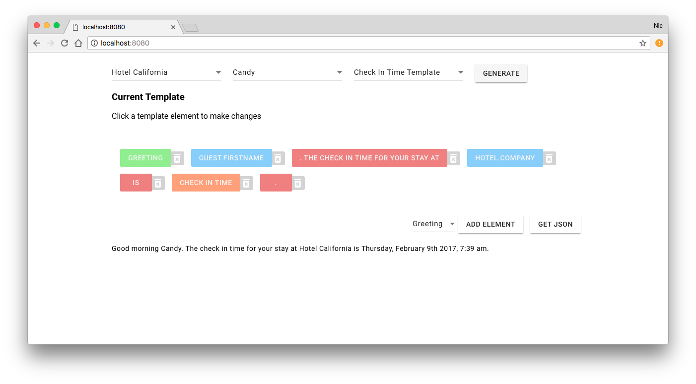

# Message Maker

Message Maker is a web application for creating and populating templates with data. Message Maker was built using JavaScript ES6 and jQuery, with a sprinkling of Moment.js and lodash. The interface for the application was created using Google's Material Components for Web.

### Preview

## Instructions

### Installation

The app can be viewed live [here](https://nicolaslwilson.github.io/message-maker/dist/).

To run Message Maker locally:

1. Download and unpack the .zip or clone the repository
2. Run `npm install` to install dependencies
3. Run `npm start` to start the Webpack Development Server
4. The application should build and open automatically in your default web browser at `localhost:8080`.

### Use

Using the select inputs at the top of the page a user can select an existing template as well as the data to populate that template. By clicking the `Generate` button the user can get the template output on the DOM.

Templates in Message Maker are made up of arrays of `Template Elements`. These elements include static strings, variables that can be filled with input data, times and an element to generate a greeting based on the local time of day. Although the interface doesn't support it, the underlying Template class would even allow a user to build a template using other templates.

The elements that make up the currently selected template are displayed on the page. Clicking individual template elements allows a user to edit their value. The user is also able to select template elements from a drop down and add new elements to the template. Any changes a user makes to the template will be reflected in the output the next time the user clicks `Generate`.

## Future Development

There are many avenues I'm interested in pursuing for future development. Given the relatively short amount of time available for this particular project an immediate priority would be to increase test coverage as well as refactor parts of the code base to adhere to [Google's JavaScript Style Guide](https://google.github.io/styleguide/jsguide.html). Additional data validation and error handling would also be necessary for a production application.

Another area for expansion would be add more varieties of template elements. For example, it might be useful to include a template element that calculates the time remaining until a guest's flight or checkout. Expanding the template functionality is relatively easy due to the modular nature of the Template class I created. 

Finally, while a user can currently create a custom template and output that template as JSON, connecting the application to a database to allow users to store custom templates for future use would be important.

